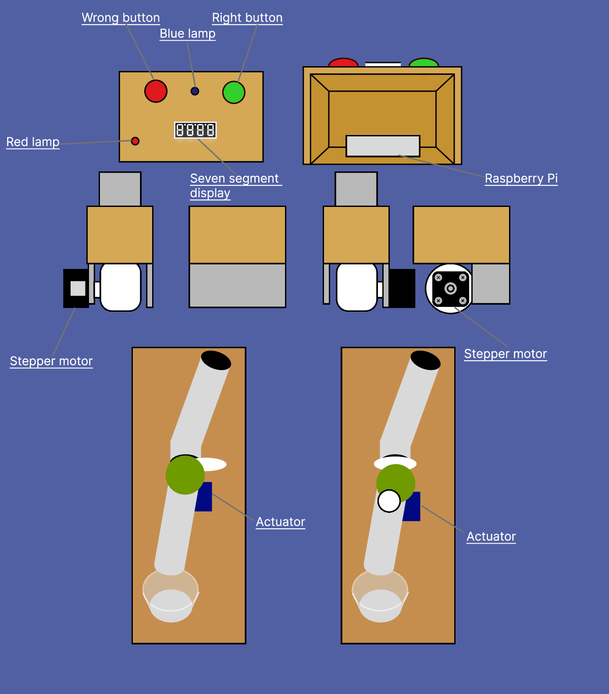

# PAD-3

## Developers
Jack Zwuup, Maurice Peetoom, Mike Schardijn & Timo Lambregt
## Table of Contents
1. [ Description ](#Desc)
2. [ Background information. ](#Bain)
3. [ How to use the Project ](#Htutp)
4. [ Program set-up ](#Psu)
4. [ Game instructions ](#Gain)
5. [ Usage ](#Usage)
6. [Sources and documents](Sandd)

## Description
Our application is made to help elderly with possible loneliness on the instructions of Amstelhuis in Amsterdam. To give our support as programmers we used a NAO robot to play a simple game with the elderly. This robot can be put in a public space inside an elderly home and is approachable for people to play. Some limitations arise with the limitations of the NAO robot. The movement can be limited and unpredictable. However, in the future a nice feature would be that the robot can do all movements regarding the playing cards.

## Background information
The assignment originator of our project is Ed Kuijpers, his goal for us is to make a product that can entertain the elderly.

## Functional design

## How to use the Project

#### Hardware
- NAO robot
- Raspberry Pi 3
  - Seven segment display
  - Card dispenser
  - Candy dispenser
  - Two buttons
  - Wiring

#### Software
* Java
* Python

### Libraries
* [java-naoqi-sdk-2.5.6.5-win32-vs201](http://doc.aldebaran.com/1-14/dev/java/index.html#java)
* [org.eclipse.paho.client.mqttv3](https://www.eclipse.org/paho/files/javadoc/org/eclipse/paho/client/mqttv3/package-summary.html)

## Program set-up
#### Java code
1. Install program, that can run Java code.
2. Download and install the libraries above.
3. Connect the robot to the device.

#### Python code
1. This is going to be explained by Timo.

## Game instructions

Hello and welcome bij bussen.

##### Voorbereiding van het spel
You should have 20 playing cards and a card dispenser that holds those cards. There are a total of 3 rounds. You start with 100 points.

##### Het spel
The robot says the recitation. Guess the answer would be, then press the corresponding button. Show the card at a distance of one decimetre. If the answer is correct, you will receive 50 points and a candy. If not, 50 points will be deducted. Try to play as many rounds as possible. The more rounds the better. If you have 0 points you lose the game. Good luck!

## Usage
This project is used to imply a game named Bussen. There's code used for:

#### java functions robot

+ Animations while talking
+ Barcode reader
+ Changing the eye colour
+ Face detection
+ Postures for the robot
+ Set volume
+ Text to speech
+ The connection between the robot and laptop
+ Translate speech

#### Mqtt connection
Because of the code for mqtt, is there a wireless connection between python (RaspberryPi) and java. The connections are specificly for the physical gameboard for bussen and the code for the game. MQTT is being used to communicate and can be found under libraries.

#### Python functions for RaspberryPi devices
Seven segment display:
There is code to show the score of the player on the device.

Stepper motor:
There is code for controlling the stepper motor for dispensing cards.

Buttons input:
There is code for two buttons. So the user can have a clear input by pressing the buttons.

(put connection scheme here)

#### Code explanation for Bussen:
The game starts with a welcome message and with 100 points.

Round one: Code for guessing the colour of the card.

Round two: Code for if the card is lower or higher than the value of the previous one.

Round three: Code for if the card is in between or outside the values of card one and card two.

For every round:

The state of the card is guessed by the user, the card is than scanned. The robot checks if the card is correct. Adds or subtracts points.

## Sources and documents

